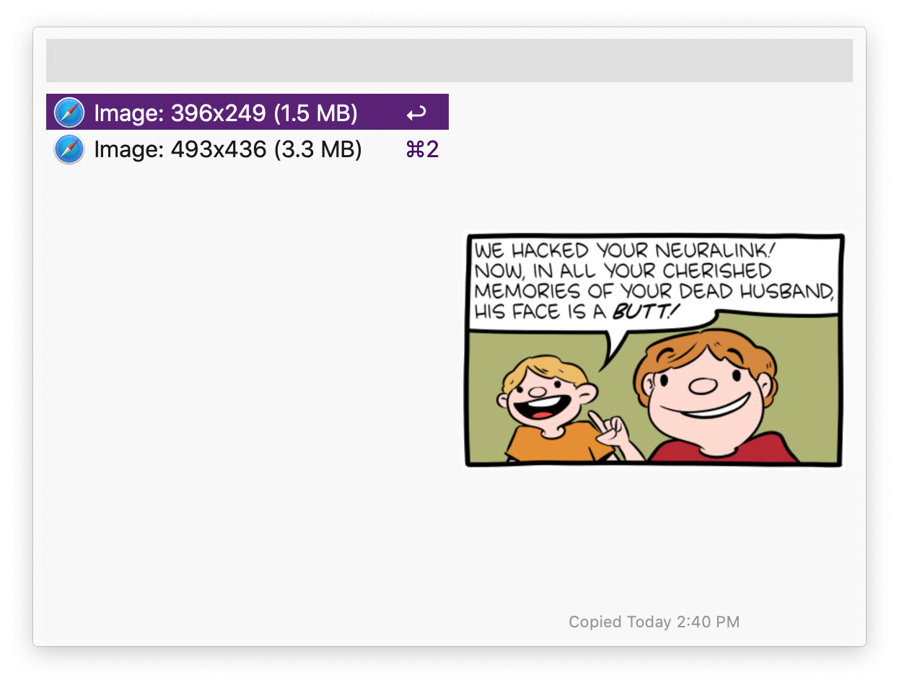
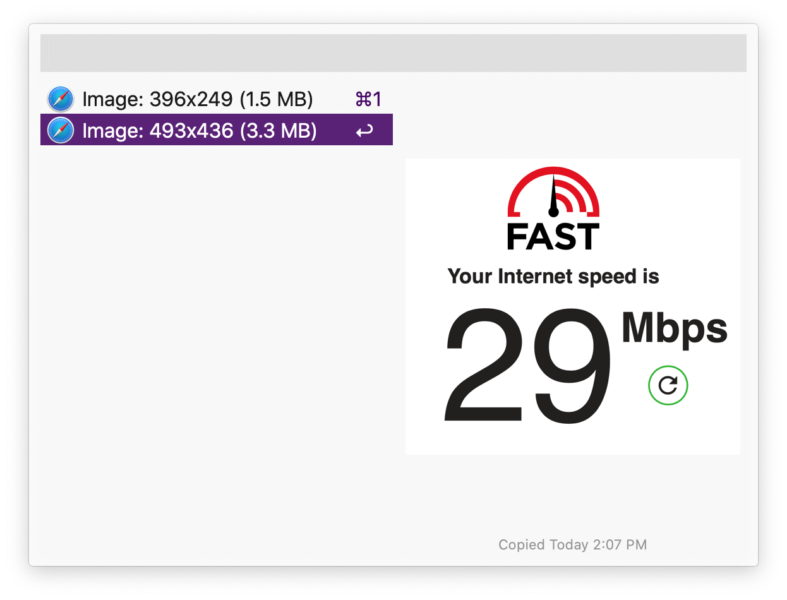
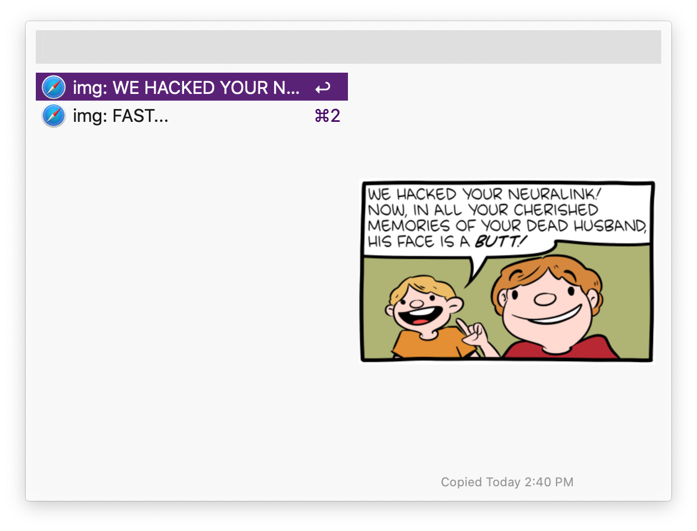
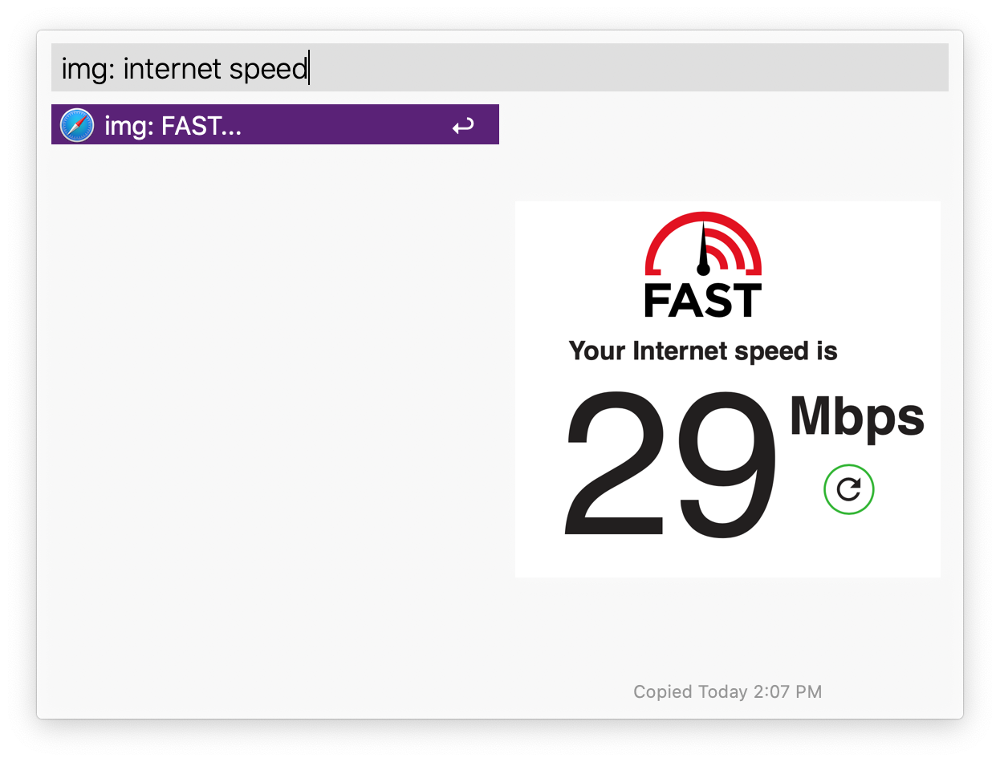
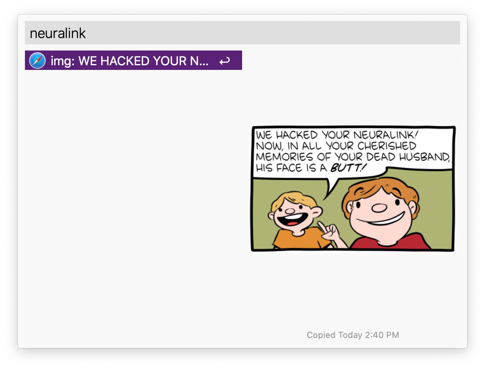

# Clipboard History OCR for Alfred
Make images in [Alfred](https://alfredapp.com)'s clipboard history
searchable by their text content.

Alfred's clipboard history includes images too.
However, there's no way to search through them.
For example, in the screenshots below, are two images in the clipboard history,
but the only "searchable" information about them is dimensions and size.
 

This tool runs OCR every time an image is copied to clipboard,
and makes the image searchable using that text. 
 

### Setup
 1. Download the [latest release](https://github.com/mr-pennyworth/alfred-clipboard-ocr/releases/latest/download/Clipboard.History.OCR.alfredworkflow).
 2. Type `.clipboard-history-ocr-install`
 3. Done!

### Uninstall
 1. Run `.clipboard-history-ocr-uninstall` in Alfred.
 2. Delete the workflow from Alfred.

### Credits
 - [Tesseract OCR](https://github.com/tesseract-ocr/tesseract)
 - [Mac dilyb bundler](https://github.com/auriamg/macdylibbundler)
 - Icon made by combining icons from [flaticon](https://www.flaticon.com)
   by [Pixel Perfect](https://www.flaticon.com/authors/pixel-perfect) and
   [Dimitry Miroliubov](https://www.flaticon.com/authors/dimitry-miroliubov).
